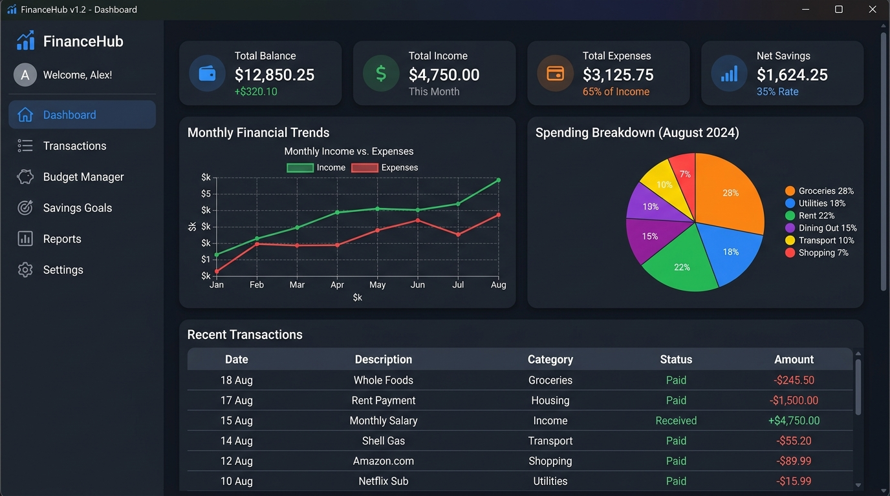

# 💰 Personal Finance System

A modern, offline-first desktop application for managing income, expenses, monthly budgets, and savings goals — with beautiful dark-mode charts and a one-click Windows launcher.



---

## Features

- Track income and expenses with categories
- Set monthly budgets and get alerts when overspending
- Savings goals with progress tracking
- Visual reports: trend, breakdown, comparison charts
- Export data to CSV
- Dark/Light theme

---

## Tech Stack

| Component | Technology |
| --- | --- |
| **Language** | Python |
| **GUI Framework** | CustomTkinter |
| **Database** | SQLite |
| **Data Visualization** | Matplotlib |
| **Packaging** | PyInstaller |

---

## Getting Started

### Option A — Run from Source (Developers)

```bash
git clone <repo-url>
cd "Personal Finance System"
python -m venv .venv
.venv\Scripts\activate
pip install -r requirements.txt
python src/main.py
```

### Option B — One-Click Windows Launch

Double-click **`run.bat`** in the project root.  
It automatically creates the virtual environment, installs dependencies, and launches the app.

### Option C — Standalone .exe (No Python Required)

```bash
# Build the executable (run once)
build.bat

# Then launch
dist\PersonalFinanceSystem\PersonalFinanceSystem.exe
```

---

## User Guide

### 🗂️ Navigation

The left sidebar contains six pages. Click any item to switch views:

| Sidebar Item | Purpose |
|---|---|
| **Dashboard** | High-level financial summary for the current month |
| **Transactions** | Log, view, filter, and delete all income/expense entries |
| **Budget Manager** | Set monthly spending limits per category |
| **Savings Goals** | Create and fund long-term savings targets |
| **Reports** | Interactive charts — trends, breakdowns, comparisons |
| **Settings** | Currency, theme, and category customisation |

---

### 📋 Transactions

**Adding a transaction:**
1. Navigate to **Transactions**.
2. Choose the type: `Income` or `Expense`.
3. Select a **Category** from the dropdown (e.g. Salary, Food, Rent).
4. Enter the **Amount** and an optional **Description**.
5. Pick a **Date** (defaults to today).
6. Click **Add Transaction** — it appears instantly in the table below.

**Filtering:**
- Use the **Month / Year** dropdowns to view a specific period.
- Use the **Type** filter (`All / Income / Expense`).
- Type in the **Search** box to find transactions by description.

**Deleting a transaction:**
- Select any row in the table and click **Delete Selected**.

**Exporting to CSV:**
- Click **Export CSV** — a file dialog will ask where to save `transactions.csv`.

---

### 🎯 Budget Manager

**Setting a budget:**
1. Navigate to **Budget Manager**.
2. Select the **Month** and **Year** you want to budget for.
3. Choose a spending **Category** (expense categories only).
4. Enter a **Limit Amount** (e.g. ₹5000 for Food).
5. Click **Set Budget**.

**Reading the progress bars:**
- 🟢 **Green** — spending is within budget.
- 🟡 **Amber** — spending is above 80 % of the limit (warning alert).
- 🔴 **Red** — budget limit exceeded.

Each row shows: `Category | Spent | Limit | Progress bar`.

---

### 💰 Savings Goals

**Creating a goal:**
1. Navigate to **Savings Goals**.
2. Enter a **Goal Name** (e.g. "Emergency Fund").
3. Enter the **Target Amount** (e.g. ₹50000).
4. Optionally set a **Deadline** date.
5. Click **Create Goal**.

**Adding funds to a goal:**
1. Select the goal card.
2. Enter the **Deposit Amount**.
3. Click **Add Funds**.
4. The progress bar updates instantly.

A goal is automatically marked **Completed** when `current ≥ target`.

---

### 📊 Reports & Visualizations

Three chart types are available. Use the **left control panel** to switch:

| Chart | Description |
|---|---|
| **Trend** | Multi-month line chart — income vs expenses over time |
| **Breakdown** | Donut chart — expense distribution across categories for a chosen month |
| **Comparison** | Grouped bar chart — month-by-month income vs expense comparison |

**Controls:**
- Select **Year** (and **Month** for the Breakdown chart).
- Click **Generate Chart** to render.
- Charts are embedded inside the app — no external window opens.

---

### ⚙️ Settings

| Setting | Options |
|---|---|
| **Currency Symbol** | ₹, $, €, £ (updates all displays app-wide) |
| **Appearance Theme** | Dark / Light |
| **Income Categories** | Add or remove custom income category names |
| **Expense Categories** | Add or remove custom expense category names |

> Changes to theme and currency take effect immediately without restart.

---

## Project Structure

```text
Personal Finance System/
├── assets/                  # Application screenshot and visual assets
│   └── icons/               # Windows .ico file for the packaged executable
├── data/                    # SQLite database storage (data/finance.db)
├── src/                     # Application source code
│   ├── database/            # Database schema management and Data Access Objects (DAOs)
│   │   ├── dao/             # Transaction, Category, Budget, and Savings DAOs
│   │   ├── db_manager.py    # SQLite connection manager
│   │   └── schema.py        # DDL tables and default seed data
│   ├── gui/                 # CustomTkinter interface
│   │   ├── components/      # Sidebar and Header bar
│   │   ├── pages/           # Dashboard, Transactions, Budget, Savings, Reports, Settings
│   │   └── app.py           # Main window shell and page router
│   ├── models/              # Data models and structures
│   ├── services/            # Core business logic layer
│   │   ├── finance_service.py
│   │   ├── budget_service.py
│   │   ├── savings_service.py
│   │   └── settings_service.py
│   ├── utils/               # Currency formatting and CSV export helpers
│   ├── config.py            # Global constants, DB path resolution (dev + packaged)
│   └── main.py              # Application entry point
├── tests/                   # In-memory SQLite unit test suite (28 tests)
├── .gitignore               # Version control exclusion rules
├── personal_finance.spec    # PyInstaller build specification
├── build.bat                # One-click build script → produces dist/PersonalFinanceSystem.exe
├── run.bat                  # One-click launch script for development
├── requirements.txt         # Project dependencies
└── README.md                # Project documentation
```

---

## Running Tests

```bash
python -m pytest tests/ -v
```

All 28 tests use an in-memory SQLite database and run in under 1 second.

---

## Building the Standalone .exe

```bash
# From project root (with .venv active):
pyinstaller --noconfirm --clean personal_finance.spec

# Or simply double-click:
build.bat
```

Output is placed in `dist\PersonalFinanceSystem\`.  
The database (`finance.db`) is created automatically in the **same folder** as the `.exe` on first run.

---

## License

MIT
